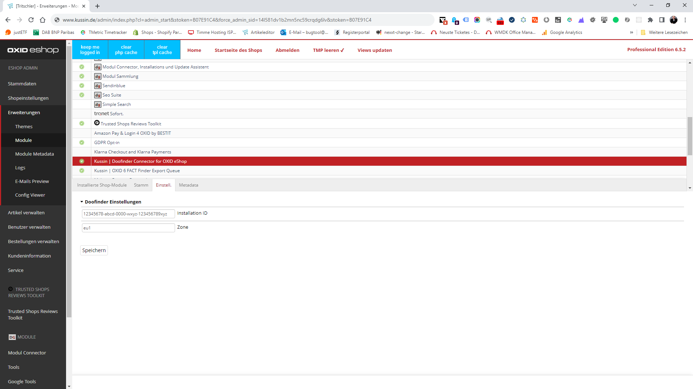

# Kussin | Doofinder Connector for OXID eShop

The module replaces OXID eShop search bar with a search bar from [Doofinder](https://www.doofinder.com/).
Basically it does the whole [Installation Process Setp 4](https://support.doofinder.com/getting-started/installing-doofinder#step-4-script) 
for you.

## Module Settings

### General Configuration

Basic settings of the extension including the module activation.

**The following configuration options are available:**

1. [`installationId`](https://github.com/kussin/OxidDoofinder/blob/main/modules/kussin/doofinder/views/blocks/base_js.tpl#L11) - Doofinder Installation ID
2. [`zone`](https://github.com/kussin/OxidDoofinder/blob/main/modules/kussin/doofinder/views/blocks/base_js.tpl#L12) - Doofinder Zone

## Bugtracker and Feature Requests

Please use the [Github Issues](https://github.com/kussin/OxidDoofinder/issues) for bug reports and feature requests.

## Support

Kussin | eCommerce und Online-Marketing GmbH 
Fahltskamp 3 
25421 Pinneberg 
Germany

Fon: +49 (4101) 85868 - 0 
Email: info@kussin.de

## Copyright

&copy; 2006-2023 Kussin | eCommerce und Online-Marketing GmbH